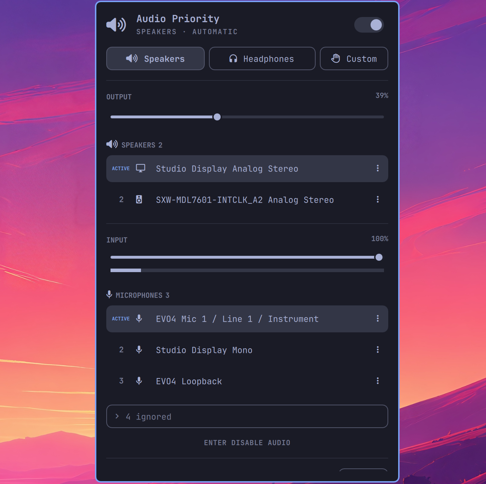

# Audio Priority for Omarchy

Audio Priority automatically selects the highest-priority available speakers,
headphones, and microphone from the Omarchy bar. It is a native Quickshell port
of [AudioPriorityBar](https://github.com/tobi/AudioPriorityBar), with the same
routing state machine and an interface built from Omarchy's theme-aware UI kit.



## Features

- Independent priority lists for speakers, headphones, and microphones
- Automatic selection of the highest-priority connected device
- Automatic Headphones mode when headphones connect and Speakers fallback when
  the last pair disconnects, including wired headphones on a laptop's jack
- Custom mode for unrestricted manual routing with automatic switching paused
- Persistent memory for disconnected devices and last-seen timestamps
- Drag, arrow, and click-to-promote priority editing
- Manual speaker/headphone classification with automatic first-use inference
- Per-category Ignore, global Ignore Entirely, and Never Use controls
- Output volume control from the panel or by scrolling over the bar widget
- Input volume control with a live microphone level meter
- Complete Omarchy-style keyboard navigation and numeric priority shortcuts
- Bar indicators for mode, output mute, and microphone mute
- One singleton routing authority across every monitor

The plugin is deliberately separate from Omarchy's built-in Audio widget. Both
can remain enabled, or the built-in widget can be removed from the bar after
Audio Priority is configured.

## Install

```bash
omarchy plugin add https://github.com/melonamin/omarchy-audio-priority.git
```

Omarchy plugins run as unsandboxed code in the long-lived shell. Before enabling
this plugin, review the checkout and record the exact revision you inspected:

```bash
git -C ~/.config/omarchy/plugins/melonamin.audio-priority rev-parse HEAD
omarchy plugin enable melonamin.audio-priority
```

For a reproducible installation, compare that full revision with a signed
release tag or a commit published through a trusted channel. Re-review changes
before running `omarchy plugin update`. The widget is added to the right side of
the bar when enabled; no separate daemon or systemd unit is installed.

## Use

Open the widget and choose a mode:

- **Speakers** — route to the first available device in the Speakers list.
- **Headphones** — route to the first available device in the Headphones list.
- **Custom** — stop automatic changes and select any connected device manually.

Click a device in an automatic mode to promote it to first priority and select
it. In Custom mode, clicking changes the default without changing priorities.
Use the drag handle or arrow buttons to reorder. Open a row's action menu to
classify, ignore, prohibit, or restore it.

Edit mode includes every remembered device. Disconnected devices keep their
place, show when they were last seen, and can be forgotten.

Keyboard shortcuts inside the panel:

- `j`/`k` or arrows navigate; `Enter`/`Space` activates
- `h`/`l` adjusts the selected output or input level
- `s`, `p`, and `c` select Speakers, Headphones, and Custom mode
- `1`–`9` moves the selected device directly to that priority; `0` means tenth
- `Shift+j`/`Shift+k` moves the selected device one position
- `a` opens the selected device's actions; `Esc` backs out or closes
- `e` toggles Edit mode

## State and behavior

State is stored atomically in:

```text
~/.config/omarchy/audio-priority.json
```

The persisted fields and transition rules are documented in
[`docs/reference-contract.md`](docs/reference-contract.md). Manual device
selection in Custom mode does not change priorities; explicit reordering still
does. Enabling automatic mode immediately applies the highest-priority available
input and output.

The file is watched. An edit made outside the panel is applied to the connected
devices as soon as it is saved. An empty file at startup is treated as a fresh
install; one that becomes empty while the service runs is ignored, because some
editors truncate before they write, and the next save restores it. A file that
is not valid JSON is left untouched, and the bar widget shows a
warning glyph with the parse error in its tooltip until it is repaired.
The plugin limits the state document to 262,144 characters, each persisted list
to 256 entries, and device-controlled fields to 512 characters. Oversized state
is rejected while the last valid in-memory configuration remains active. The
state directory and file are required to be owned by the current user, may not
be symlinks, and are kept at modes `0700` and `0600` respectively.

A sound card whose node exposes several ports, such as a laptop's speakers and
headphone jack, is remembered as one device per port (`Analog Stereo · Speaker`
and `Analog Stereo · Headphones`), so plugging into the jack behaves like
connecting headphones. Device changes arrive through `pactl subscribe`; a slow
timer only backs that stream up.

## Requirements

- Omarchy Quattro 4.0.2 or newer with plugin support
- Quickshell 0.3.1 or newer
- PipeWire and WirePlumber
- Bash, GNU coreutils, `awk`, `pactl`, `wpctl`, and Omarchy's standard audio
  helpers (`omarchy-audio-input-set-default`,
  `omarchy-audio-output-set-default`, and
  `omarchy-audio-sink-availability`)

Runtime audio control is restricted to the local PipeWire Pulse socket beneath
`XDG_RUNTIME_DIR`; the plugin makes no internet requests and requires no
credentials or elevated privileges. Finite helpers have hard deadlines, helper
output is bounded, and an unavailable or malformed sink status fails closed.

Release tags should be signed and should identify the exact Omarchy and
Quickshell versions used for validation. The repository intentionally has no
downloaded executable artifacts or package-manager dependencies.

## Development

```bash
tests/run
```

The suite checks the pure state-machine port, verified routing behavior, the
sink status helper against captured `pactl` output, manifest validity, and QML
syntax. It then runs the service end to end under Quickshell against a private
PipeWire daemon (no session manager, so no real device is ever routed) with the
Omarchy helpers replaced by fixtures, covering state-file creation, external
edits, truncation, invalid JSON, the self-save reload guard, event-stream
backoff, and the missing-source-directory error. The QML files are linted against the Omarchy shell sources found in
`~/.local/share/omarchy/shell` or `/usr/share/omarchy/shell`; set
`OMARCHY_SHELL_DIR` to point elsewhere. The end-to-end step needs `qs`, `jq`, and a
`pipewire` binary it can start privately. For local development, symlink the
repository at `~/.config/omarchy/plugins/melonamin.audio-priority` (the plugin
validator forbids symlinks inside a plugin folder, not the folder itself) and
rescan plugins.

## Attribution

The behavior and interaction model are based on Toby Lütke's MIT-licensed
[AudioPriorityBar](https://github.com/tobi/AudioPriorityBar). This port is an
independent QML/JavaScript implementation for PipeWire and Omarchy.
